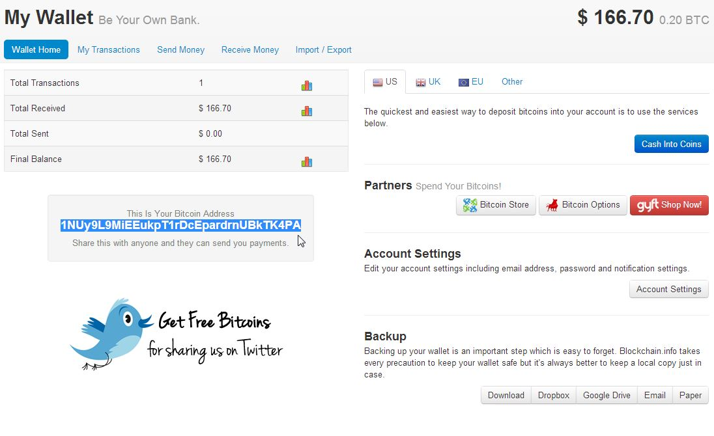
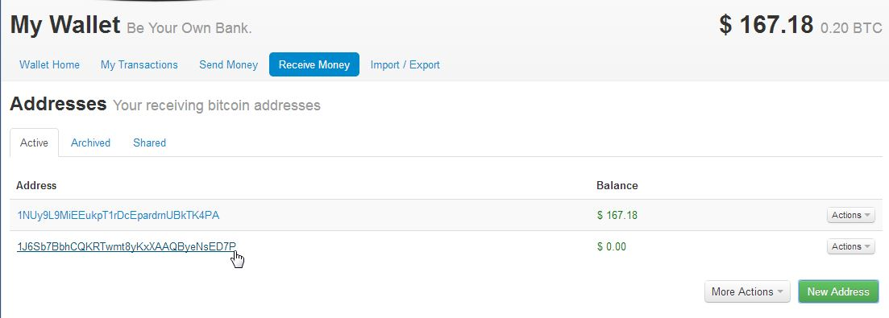
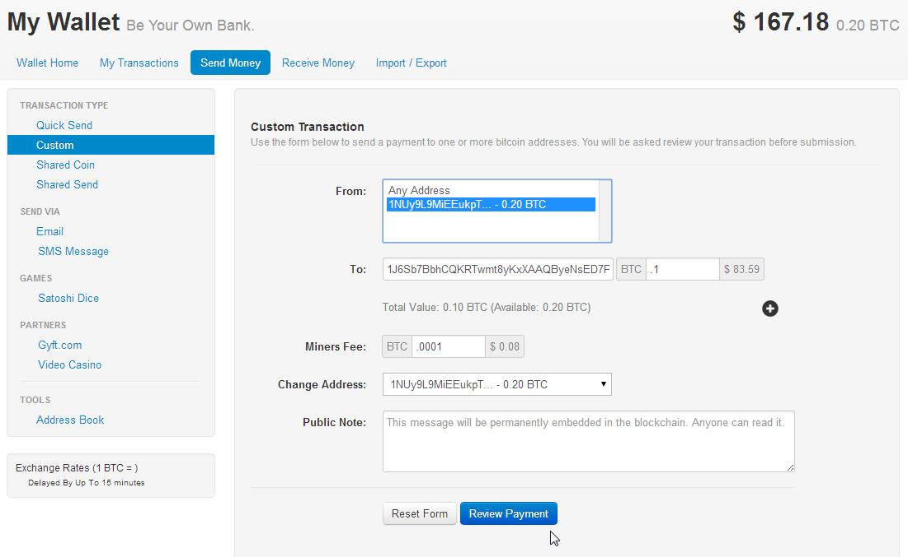
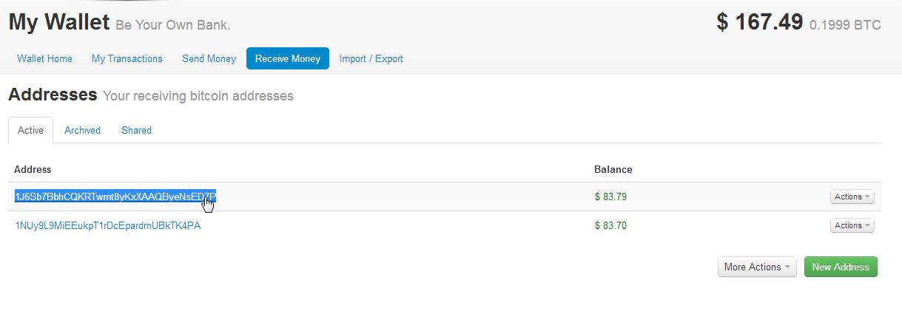
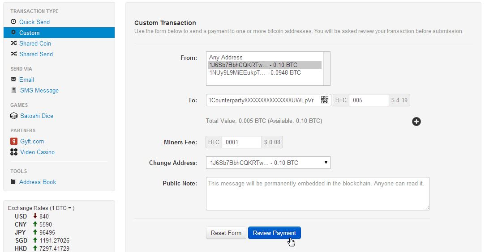
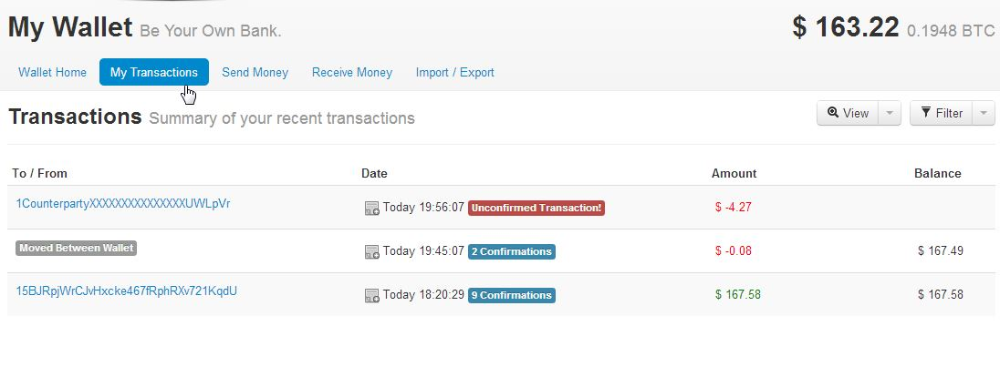
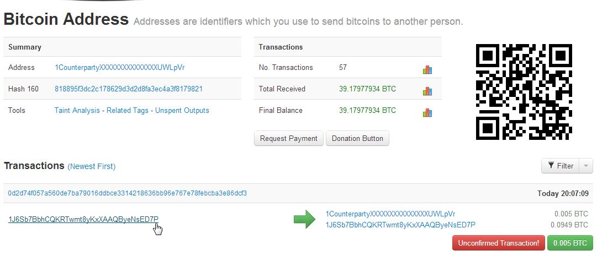
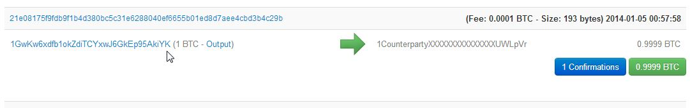

How to Burn Bitcoin (to generate XCP)
======================================

.. warning::

   This document is valid only during the "burn" period of Bitcoin blockrange between 278310 and 283810.
   Please do not try burning after this period. 

Using counterpartyd
----------------------

``counterpartyd`` is the preferred way to "burn" BTC to generate XCP. To burn BTC, configure ``bitcoind`` and
install ``counterpartyd`` using the instructions from the earlier sections of this document (either from source, or via the installer).

Once done, you can open up a command prompt, then, just run the command like::

    counterpartyd burn --from=<ADDRESS> --quantity=<QUANTITY>
    #under Linux
    
    C:\python33\python.exe C:\counterpartyd_build\run.py burn --from=<ADDRESS> --quantity=<QUANTITY>
    #under Windows
    
Full examples::

    counterpartyd burn --from=1J6Sb7BbhCQKRTwmt8yKxXAAQByeNsED7P --quantity=0.5
    #under Linux
    
    C:\python33\python.exe C:\counterpartyd_build\run.py burn --from=1J6Sb7BbhCQKRTwmt8yKxXAAQByeNsED7P --quantity=0.005
    #under Windows
 

Without using counterpartyd
-------------------------------------------

.. warning::

    **DISCLAIMER:** The format of a Counterparty transaction is very specific, and we can’t guarantee that a
    transaction constructed by any other software will work (and if it doesn’t, you’ll lose your BTC).

    IF YOU DO THIS, PLEASE TEST WITH VERY SMALL BURNS FIRST, BEFORE MAKING YOUR FULL BURN. WE CANNOT BE
    HELD RESPONSIBLE FOR IMPROPERLY BURNED FUNDS.

Although we recommend using ``counterpartyd`` directly, you may now "burn" BTC to get XCP without having to use ``counterpartyd``. To
do so safely, you will need to use an advanced wallet that allows some sort of coin control, like blockchain.info or multibit.

Here are the requirements for a successful "burn":

- All of the input addresses are identical.
- The address of the first output is the unspendable address ``1CounterpartyXXXXXXXXXXXXXXXUWLpVr`` (mainnet)
  or ``mvCounterpartyXXXXXXXXXXXXXXW24Hef`` (testnet).
- The total number of BTC burned by the source address is less than or equal to 1.

blockchain.info
~~~~~~~~~~~~~~~~~~~~~~~~~~~~~~~~~

To perform this burn on `blockchain.info <http://blockchain.info>`__, do the following:

**Step 1**

First, sign up with a wallet (if you haven't already) at `this link <https://blockchain.info/wallet/new>`__.

**Step 2**

Once created, send money to your wallet using the receive address listed. Once sent, it should appear in your
total balance in the upper right hand side of the screen.

**Step 3**

Next, click on the "Receive Money" tab, and click on the green "New Address" button. This will generate a second
address, which you will be sending money to, so that you can burn that money for XCP.

**Step 4**

Click on the "Send Money" tab, then click on "Custom" under "Transaction Type". Do the following:

- Ensure that your main address (that you sent the BTC to) is selected under the **"From"** box
- In the **"To"** box, enter the new address that you just created (in my case, ``1J6Sb7BbhCQKRTwmt8yKxXAAQByeNsED7P``). 
  Choose an amount less than 1 BTC to send over (as each address is limited to "burning" 1 BTC total).
- For **"Miners Fee"**, entering .0001 is a good bet (so your transaction goes through faster)
- Under **"Change Address"**, you should choose the same address as your **"To"** address

Once done, click on the "Review Payment" button. Make sure it's what you want, then click the "Send Transaction" button.

**Step 5**

Now, click back on "Recieve Money" and you should see that the address you just created (``1J6Sb7BbhCQKRTwmt8yKxXAAQByeNsED7P`` in this case)
has some funds now (in this case, the .1 BTC we sent, listed as dollars):

**Step 6**

Now, we're going to "burn" the .1 BTC in ``1J6Sb7BbhCQKRTwmt8yKxXAAQByeNsED7P``. To do this, click back on "Send Money", then "Custom". Do the following:

- Ensure that the address you want to burn the BTC in is selected under the **"From"** box
- In the **"To"** box, enter ``1CounterpartyXXXXXXXXXXXXXXXUWLpVr``. For the amount, enter the amount
  you wish to burn (which does not have to be the entire balance of the address, must should not exceed 1 BTC from any given address)
- For **"Miners Fee"**, entering .0001 is a good bet (so your transaction goes through faster)
- **THIS IS VERY IMPORTANT:** Under **"Change Address"**, you *must* choose the same address as your **"From"** address. 

So, in the screenshot above, I'm going to burn .005 BTC, from address ``1J6Sb7BbhCQKRTwmt8yKxXAAQByeNsED7P``.
Once you're sure you're good here, click "Review Payment", then "Send Transaction".

You can then click on the "My Transactions" tab to see the transaction you just made:

**Verification**

Click `this link <https://blockchain.info/address/1CounterpartyXXXXXXXXXXXXXXXUWLpVr>`__. You should see the
transaction listed, like so: 

"Valid" transactions look like that one above (which sends to the Counterparty burn address
(``1CounterpartyXXXXXXXXXXXXXXXUWLpVr``), **which must be listed as the first output address** and has a
change address that is the same as the sending address), OR, like the following:

Which sends the entire balance of the address (**being under 1BTC**) to the Counterparty burn address, with no change address listed.

.. note::

    You can make multiple sends from a single address to the Counterparty burn address, **as long as the
    total amount of BTC sent from that address is not greater than 1 BTC**.
